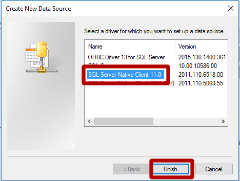
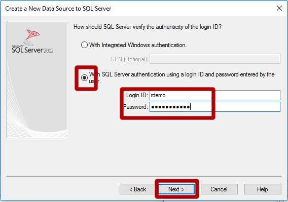
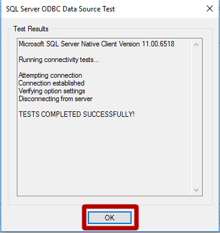

 This page describes the 
<strong>
{{ site.cig_text }}
{{ site.onp_text }}
{{ site.hdi_text }} 
</strong>
solution.
 

 

## Set up Connection between SQL Server and PowerBI  

Follow the instructions below to set up a connection between your SQL Server database and PowerBI.  Perform these steps after you have created the <code>Campaign</code> database.

Follow the instructions below to set up a connection between your Hive table and PowerBI.  Perform these steps after you have <a href="Typical.html">created the <code>recommendations</code> table by executiong the <strong>campaign_main.R</strong> and <strong>campaign_scoring</strong> </a> scripts.

<ol>
<li class="hdi">Download and install the <a href="https://www.microsoft.com/en-us/download/details.aspx?id=49883">Spark ODBC driver.</a></li>
<li>	Push the <code>Windows</code> key on your keyboard</li>
<li>	Type <code>ODBC</code> </li>
<li>	Open the correct app depending on what type of computer you are using (64 bit or 32 bit). To find out if your computer is running 32-bit or 64-bit Windows, do the following:
<ul>
<li>	Open System by clicking the <code>Start</code> button, clicking <code>Control Panel</code>, clicking <code>System and Maintenance</code>, and then clicking <code>System</code>.</li>
<li>.	Under System, you can view the system type</li>
</ul>
</li>
<li>	Click on <code>Add</code>
   

</li>
<li class="sql">	
Select <code>Server Native Client 11.0</code> and click <code>Finish</code>.
    

</li>
<li class="hdi">
Select <code>Microsoft Spark ODBC Driver</code> and click <code>Finish</code>

</li>
<li class="sql">	
Under Name, Enter <code>Campaign</code>. Under Server enter the MachineName from the SQL Server logins set up section. Press <code>Next</code>.
    

</li>
<li class="hdi">
Under Name, Enter <code>Campaign</code>. Add the Host name (of the form <i>myclustername.azurehdinsight.net</i>).  For username, enter <code>admin</code>.  Enter the password you chose when you created the cluster.
 

</li>
<li class="sql">	
Select <code>SQL Server authentication</code> and enter the credentials you created in the SQL Server set up section. Press <code>Next</code>
 

</li>

 
 

<li>	Check the box for <code>Change the default database to</code> and enter <code>Campaign</code>. Press 
<code>Next</code>.
    

</li>
<li>Press <code>Finish</code>
   
 
</li>

<li class="sql">
Press <code>Test Data Source</code>
   

</li>
<li class="hdi">
Press <code>Test</code>.
</li> 
<li>	Press <code>OK</code> in the new popover. This will close the popover and return to the previous popovers.
   
 

   
 

</li>
<li>	Now that the Data Source is tested. Press <code>OK</code>

 

</li>
<li>	Finally, click <code>OK</code> and close the window 

 

</li>

You are now ready to use this connection in PowerBI by following the <a href="Visualize_Results.html">instructions here</a>.
	