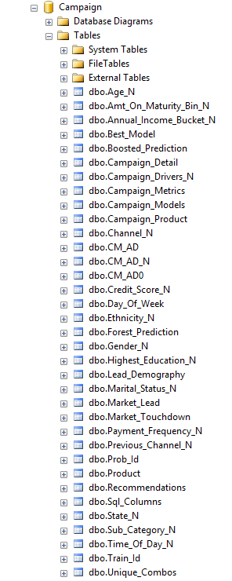

<div class="alert alert-success" role="alert"> This page describes the 
<strong>
<span class="cig">{{ site.cig_text }}</span>
<span class="onp">{{ site.onp_text }}</span>
</strong>
solution.
 

</div> 

## PowerShell Instructions
---------------------------

<div class="row">
    <div class="col-md-6">
        <div class="toc">
            <li> <a href="#setup">Setup</a></li>
            <li> <a href="#execute-powershell-script">Execute PowerShell Script</a></li>
            <li> <a href="#review-data">Review Data</a></li>
            <li> <a href="#visualizing-results">Visualizing Results</a> </li>
            <li> <a href="#other-steps">Other Steps</a></li>
        </div>
    </div>
    <div class="col-md-6">
        If you have deployed a VM through the  
        <a href="http://aka.ms/campaignoptimization">Cortana Intelligence Gallery</a>, all the steps below have already been performed and your database on that machine has all the resulting tables and stored procedures.  Skip to the <a href="Typical.html?platform=cig">Typical Workflow</a> for a description of how these files were first created in R by a Data Scientist and then deployed to SQL stored procedures.
    </div>
</div>

If you are configuring your own server, continue with the steps below to run the PowerShell script.

## Setup
-----------

First, make sure you have set up your SQL Server by following <a href="SetupSQL.html?platform=onp">these instructions</a>.  Then proceed with the steps below to run the solution template using the automated PowerShell files. 

## Execute PowerShell Script
----------------------------

Running this PowerShell script will create stored procedures for the operationalization of this solution.  It will also execute these procedures to create full database with results of the steps  – dataset creation, modeling, and scoring as described  [here](dba.html).


1.	Click on the windows key on your keyboard. Type the words `PowerShell`.  Right click on Windows Powershell to and select `Run as administrator` to open the PowerShell window.


2.	In the Powershell command window, type the following command:
  
    ```
    Set-ExecutionPolicy Unrestricted -Scope Process
    ```

    Answer `y` to the prompt to allow the following scripts to execute.

3. Create a directory on your computer where you will put this solution.  CD to the directory and then clone the repository into it:
    
    ```
    git clone https://github.com/Microsoft/r-server-campaign-optimization Campaign
    ```

4.  Now CD to the **Campaign/SQLR** directory and run one of the two following commands, inserting your server name (or "." if you are on the same machine as the SQL server), database name, username, and password.

    * Run with no prompts:
    
        ```
        .\Campaign_Optimization.ps1 -ServerName "Server Name" -DBName "Database Name" -username "" -password "" -uninterrupted "Y"  
        ```
    * Run with prompts:

        ```
        .\Campaign_Optimization.ps1 -ServerName "Server Name" -DBName "Database Name" -username "" -password "" -uninterrupted "N"  
        ```

    * For example, uninterrupted mode for the rdemo user created by the createuser.sql script on your local machine, the command would be: 

        ```
        .\Campaign_Optimization.ps1 -ServerName "." -DBName "Campaign" -username "rdemo" -password "D@tascience" -uninterrupted "Y"  
        ```

5.  If running with prompts (`-uninterrupted "N"`), you cannot complete a step until the previous step has been completed, so only skip steps that have previously been executed.

6.  You can also optionally add the parameter -dataPath "your path\to\csv files".  If you omit this, it defaults to the Data folder in the current directory.


## Review Data
--------------

Once the PowerShell script has completed successfully, log into the SQL Server Management Studio to view all the datasets that have been created in the `Campaign` database.  
Hit `Refresh` if necessary.
<br/>


[Click here](tables.html) to view more information about each of these tables.

Right click on `dbo.Recommendations` and select `View Top 1000 Rows` to preview the scored data.

[Click here](tables.html) to view the details all tables created in this solution.

## Visualizing Results 
---------------------

You've now  created and processed data, created models, picked the best one and used the model to recommend a combination of Channel/Time/Day as described  [here](data-scientist.html). This PowerShell script also created the stored procedures that can be used to score new data for the next campaign.  

Let's look at our current results. Proceed to <a href="Visualize_Results.html">Visualizing Results with PowerBI</a>.

## Other Steps
----------------

You've just completed the fully automated solution that simulates the data, trains and scores the models, and provide recommendations by executing PowerShell scripts.  

See the <a href="Typical.html">Typical Workflow</a> for a description of how these files were first created in R by a Data Scientist and then incorporated into the SQL stored procedures that you just deployed.