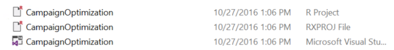
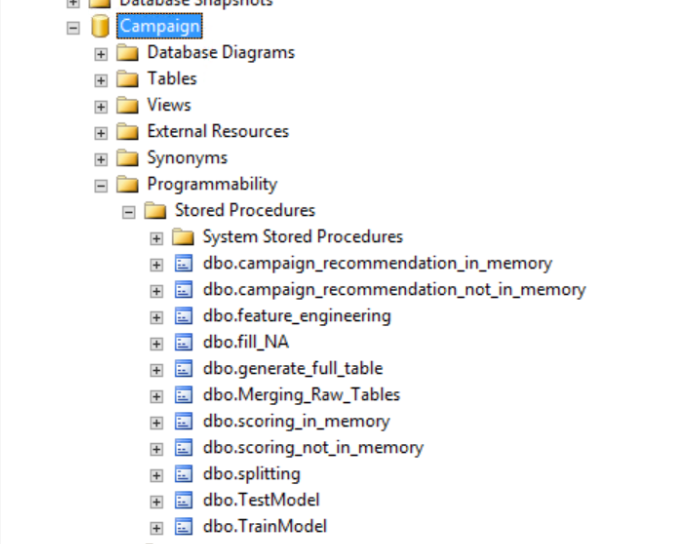

<h1>Campaign Optimization:
Typical Workflow </h1>
<h2> Cortana Intelligence Gallery Deployment</h2>

<div style="width:300px; float:right; padding-left:20px">

<h2>Table of Contents</h2>
<ul style=" list-style-type:none; padding:0; margin-left:0px;">
<li><a href="#introduction">Introduction</a></li>
<li><a href="#step1">Step 1: Server Setup and Configuration with Danny the DB Admin</a></li>
<li><a href="#step2">Step 2: Data Prep and Modeling with Debra the Data Scientist</a></li>
<li><a href="#>step3">Step 3: Operationalize with Debra and Danny</a></li>
<li><a href="#step4">Step 4: Deploy and Visualize with Bernie the Business Analyst </a></li>
</div>

## Introduction
When a business launches a marketing campaign to interest customers in some new or existing product(s), they will typically use  a set of  business rules to select leads for their campaign.  Machine learning can be used to help increase the response rate from these leads.   This solution packet shows how to use a prediction model to increase the response rate to a campaign by recommending  **how to contact** (for example, e-mail, SMS, or cold call) as well as **when to contact** (day of week and time of day) each lead identified for use in a new campaign.

This guide assumes you have deployed the Campaign Optimzation solution from the [Cortana Intelligence Gallery](https://gallery.cortanaintelligence.com/Solution/e992f8c1b29f4df897301d11796f9e7c). 

*If you are using your own SQL Server for this solution, [use this guide instead](Typical_Workflow.md).*

To demonstrate a typical workflow, we'll introduce you to a few personas.  You can follow along by performing the same steps for each persona.  While each persona would be working on a different computer, for simplicity your Virtual Machine (VM) has all the tools each persona would use on the same machine.  Follow the steps below once you have connected to that machine.

 <a name="step1" id="step1"></a>
## Step 1: Server Setup and Configuration with Danny the DB Admin

Let me introduce you to  Danny, the Database Administrator. It is Danny's job to configure and maintain the SQL Server that stores all the historical data about campaigns at our insurance company.  

Danny was responsible for installing and configuring the SQL Server.  He has added a user named 'rdemo' with all the necessary permissions to execute R scripts on the server and modify the `Campaign` database.  This has already been done on your VM.

 <a name="step2" id="step2"></a>
## Step 2: Data Prep and Modeling with Debra the Data Scientist

Now let's meet Debra, the Data Scientist. Debra's job is to use historical data to predict a model for future campaigns. Debra's preferred language for developing the models is using R and SQL. She  uses Microsoft R Services with SQL Server 2016 as it provides the capability to run large datasets and also is not constrained by memory restrictions of Open R.  After analyzing the data she opted to create multiple models and choose the best one.  

She will create two machine learning models and compare them, then use the one she likes best to compute a prediction for each combination of day, time, and channel for each lead, and then select the combination with the highest probability of conversion - this will be the recommendation for that lead.  

Debra would work on her own machine, using  [R Client](https://msdn.microsoft.com/en-us/microsoft-r/install-r-client-windows) to execute these R scripts. R Client has been installed on your VM.

Debra also uses an IDE to run R.  On your VM, R Tools for Visual Studio is installed.  You will however have to either log in or create a new account for using this tool.  If you prefer using RStudio as your IDE, you can install it to your machine instead.


Now that Debra's environment is set up, she  opens her IDE and creates a Project.  To follow along with her, navigate to the `Campaign/R` directory.  There you will see three files with the name `CampaignOptimization`:




* If you wish to use Visual Studio, double click on the "Microsoft Visual Studio" version (the third one in the image above).
* If you have downloaded RStudio, double click on the "R Project" version (the first one in the image above).


2.  First she'll develop R scripts to prepare the data.  To view the scripts she writes, open the files mentioned below.  If you are using Visual Studio, you will see these file in the `Solution Explorer` tab on the right.  In RStudio, the files can be found in the `Files` tab, also on the right.


    a.	**step1_data_processing.R**:  Performs preprocessing steps -- data cleaning and missing value treatment on the input datasets. 

    b.	**step2_feature_engineering.R**:  Performs Feature Engineering and creates the Analytical Dataset.   Feature Engineering consists of creating new variables in the market touchdown dataset by aggregating the data in multiple levels.  The table is aggregated at a lead level, so variables like channel which will have more than one value for each user are pivoted and aggregated to variables like SMS count, Email count, Call Count, Last Communication Channel, Second Last Communication Channel etc.
    
    * You can run these scripts if you wish, but you may also skip them if you want to get right to the modeling.  The data that these scripts create already exists in the SQL database. * 

3.  If you are following along, you will need to replace the connection string at the top of each file with details of your login and database name in each file.  You can copy the following and use it in each script:
   
    ```
    connection_string <- "Driver=SQL Server;Server=.;Database=Campaign;UID=rdemo;PWD=D@tascience"
    ```

    *Make sure there are no spaces around the "=" in the connection string - it will not work correctly when spaces are present*

    This connection string contains all the information necessary to connect to the SQL Server from inside the R session. As you can see in the script, this information is then used in the `RxInSqlServer()` command to setup a `sql` string.  The `sql` string is in turn used in the `rxSetComputeContext()` to execute code directly on the SQL Server machine.  You can see this in the .R files:

    ```
    connection_string <- "Driver=SQL Server;Server=.;Database=Campaign;UID=rdemo;PWD=D@tascience"
    sql <- RxInSqlServer(connectionString = connection_string)

        ...

    rxSetComputeContext(sql)
    ```

    
 4.  After running the first two scripts, Debra goes to SQL Server Management Studio to log in and view the results of feature engineering by running the following query in SSMS.

  ```
  SELECT TOP 1000 [Lead_Id]
    ,[Sms_Count]
    ,[Email_Count]
    ,[Call_Count]
    ,[Previous_Channel]
  FROM [Campaign].[dbo].[CM_AD]
  ```

5.  Now she is ready for training the models.  She creates and executes the script you can find in **step3_training_evaluation.R**. Again, remember to replace the `connection_string` value with your information at the top of the file before you run this yourself.)  This step will train two different models and evaluate each.  when you run this code, you can examine the two ROC curves for the models in the plot window once the execution is finished.

6.  Finally Debra will create and execute **step4_campaign_recommendations.R** to scores data for leads to be used in a new campaign. The code uses the champion model to score each lead multiple times - for each combination of day of week, time of day, and channel - and selects the combination with the highest probability to convert for each lead.  This becomes the recommendation for that lead.  The scored datatable shows the best way to contact each lead for the next campaign. The recommendations in this table (`Recommendations`) are used for the next campaign the company wants to deploy.

  * This step may take 10-15 minutes to complete.  Feel free to skip it if you wish, the data already exists in the SQL database. *

7.  Debra will now use PowerBI to visualize the recommendations created from her model.  She creates the PowerBI Dashboard which you can find in the `Campaign` directory.  She uses an ODBC connection to connect to the data, so that it will always show the most recently modeled and scored data, using the [instructions here](Visualize_Results.md).


The dashboard file is included in the `Campaign` directory.

8.  A summary of this process and all the files involved is described in more detail [here](../data-scientist.md).

 <a name="step3" id="step3"></a>
## Step 3: Operationalize with Debra and Danny

Debra has completed her tasks.  She has connected to the SQL database, executed code both locally and on the SQL machine to clean the data, create new features, train two models and select the champaion model. She's scored data, created recommendations, and also created a summary report which she will hand off to Bernie - see below.

While this task is complete for the current set of leads, our company will want to perform these actions for each new campaign that they deploy.  Instead of going back to Debra each time, Danny can operationalize the code in TSQL files which he can then run himself each month for the newest campaign rollouts.

Debra hands over her scripts to Danny who adds the code to the database as stored procedures.  You can see these procedures by logging into SSMS and opening the `Programmability>Stored Procedures` section of the `Campaign` database.


You can find this script in the **SQL** directory, and execute it yourself by following the [PowerShell Instructions](Powershell_Instructions.md).  As noted earlier, this was already executed when your VM was first created.  

 <a name="step4" id="step4"></a>
## Step 4: Deploy and Visualize with Bernie the Business Analyst 

Now that the predictions are created and the recommendations have been saved, we will meet our last persona - Bernie, the Business Analyst. Bernie will use the Power BI Dashboard to learn more about the recommendations (first tab). He will also review summaries of the data used to create the model (second tab).  While both tabs contain information about Day of Week, Time of Day, and Channel, it is important to understand that on the Recommendations tab this refers to predicted recommendations to use in the future, while on the Summaries tab these values refer to historical data used to create those recommendations.  

Bernie will then let the Campaign Team know that they are ready for their next campaign rollout - the data in the `Recommendations` table contains the recommended time and channel for each lead in the campaign.  The team uses these recommendations to contact leads in the new campaign.
