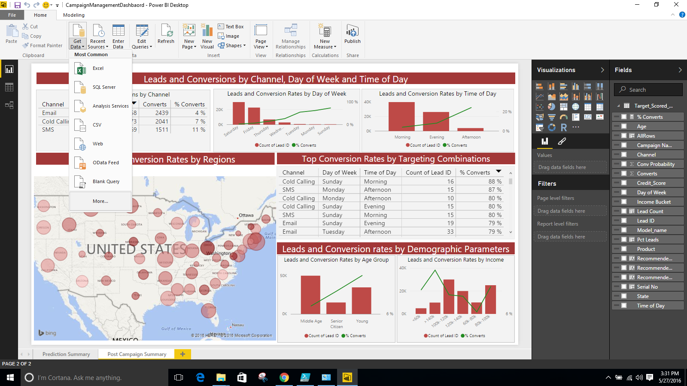
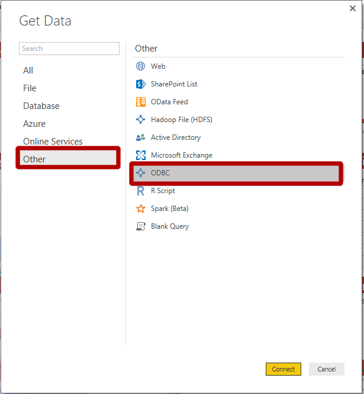
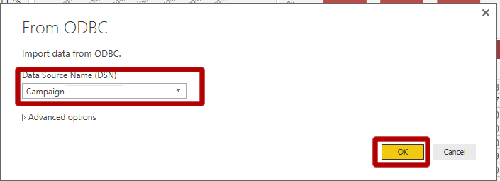
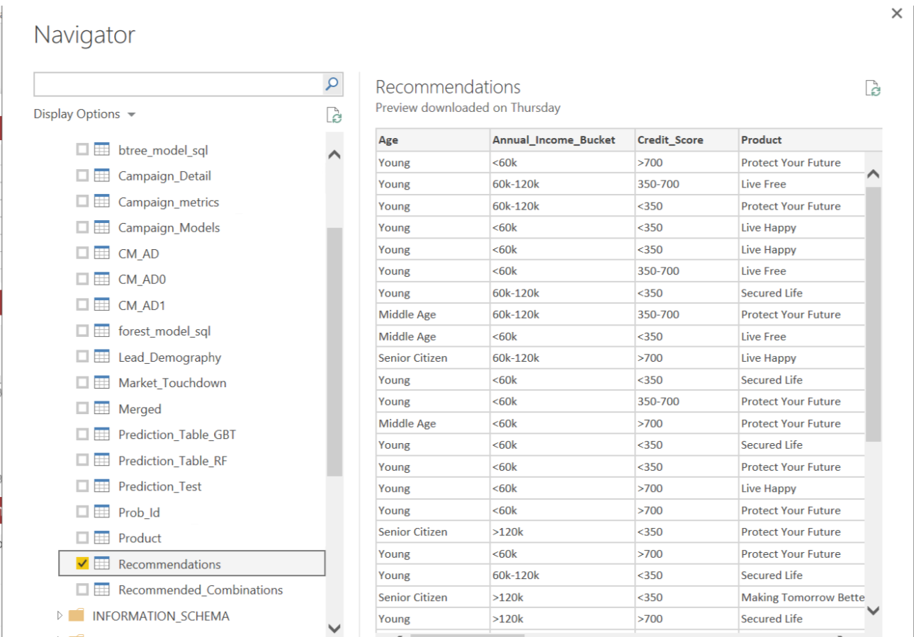
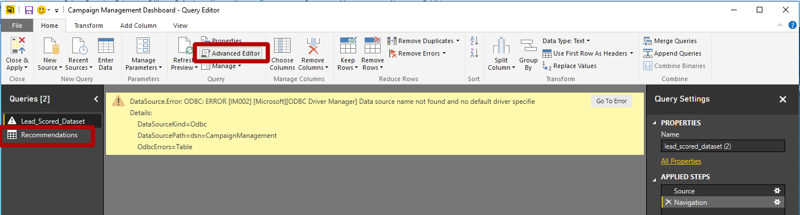
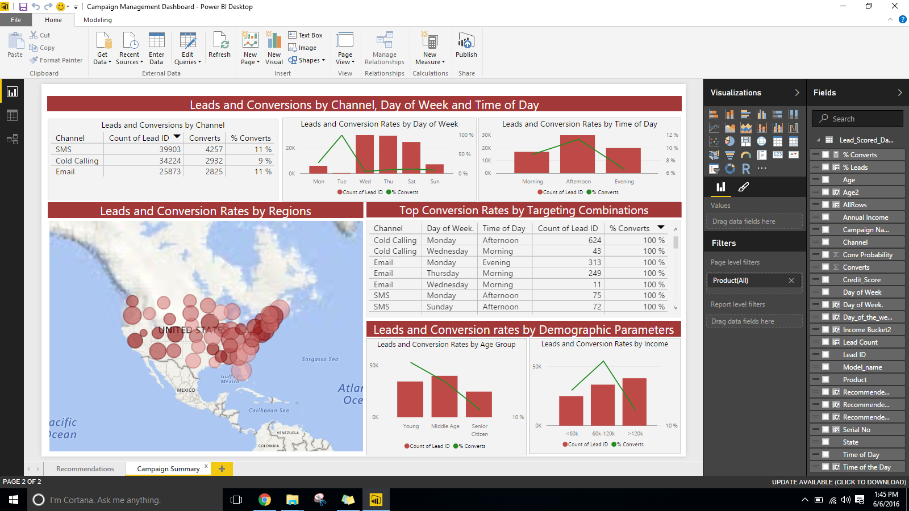

## Visualizing Results with PowerBI
-----------------------------------

These instructions show you how to replace the cached data in the PowerBI dashboard with data from your SQL Server solution, by using an ODBC connection to the SQL Database table. 

Steps 1-10 only need to be performed once. After you have performed this once, you can simply <a href="#laststep">
skip to step 11</a> to see new results after any new model scoring. 

1.  Set up Connection between SQL Server and PowerBI  using [these instructions](ODBC.html).

1.	Open the `Campaign Optimization Dashboard.pbix` file in the Campaign folder. Click on `Get Data` and select `More...`
The PowerBI dashboard will show charts built from cached data. We need to set it up to use the latest available scored dataset in the SQL Server.
  
 

2.	Select `Get Data` then `Other` and then select`ODBC` and Click `OK`
  
 

3.	Under Data Source Name Enter `Campaign` and click `OK`
  
 

4.	Navigate to Campaign >  dbo and check Recommendations. Click `Load`
  
 

5.	Once the data is loaded. Click on `Edit Queries`. You will see this new window
  
 
    Notice that on the left hand side you have 2 datasets: `Lead_Scored_Dataset` and `Recommendations`. 

6.	Click on the second dataset (`Recommendations`) and then click on ‘Advanced Editor’ in the toolbar. Select and copy all the code in the dialog that appears.  Then click `Done` to close this dialog.

7.	Next, click on the first dataset (`Lead_Scored_Dataset`) and then click on ‘Advanced Editor’ in the toolbar. Delete all the code here and paste what you just copied into this dialog.  Click `Done` to close this dialog.  You should see the earlier warning disappear and be replaced with a table of data.  This is the data from the SQL database.  

8.	Next, click on the second dataset (`Recommendations`)  and press the delete key on your keyboard. You will see a pop up asking if you want to delete it. Click on `delete`.  
  
 

9.	Next, click on `Close` and `Apply`. This will refresh the backend data on the PowerBI and connect it to the SQL Server
  
 

10.	Press `Refresh`. This should refresh the back end data of the dashboard and refresh the visuals.  You are now viewing data from your SQL Database, rather than the imported data that was part of the initial solution package.  Updates from the SQL Database will be reflected each time you hit `Refresh`. 
  
 

[&lt; Home](index.html)