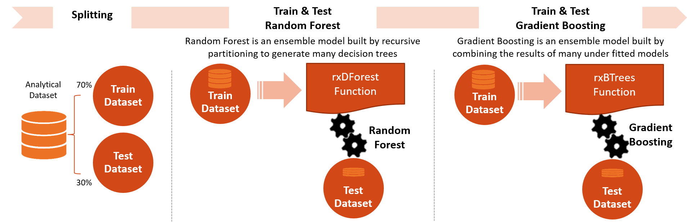
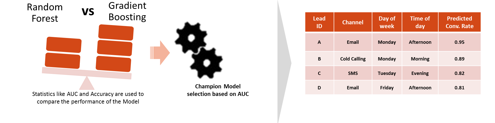
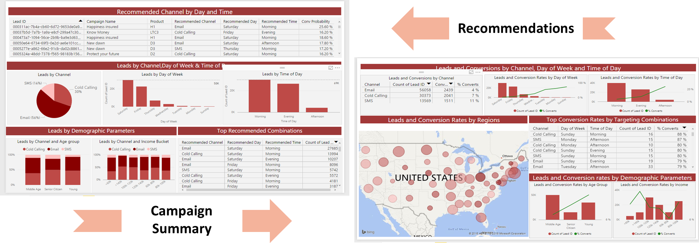

 This page describes the 
<strong>
{{ site.cig_text }}
{{ site.onp_text }}
{{ site.hdi_text }} 
</strong>
solution.
 

 

## For the Data Scientist - Develop with R
----------------------------

    

        

            <li><a href="#campaign-optimization">Campaign Optimization</a></li>
            <li><a href="#analytical-dataset-preprocessing-and-feature-engineering">Analytical Dataset Preprocessing and Feature Engineering</a></li>
            <li><a href="#model-development">Model Development</a></li>
            <li><a href="#computing-recommendations">Computing Recommendations</a></li>
            <li><a href="#deploy-and-visualize-results">Deploy and Visualize Results</a></li>
            <li class="sql"><a href="#requirements">System Requirements</a></li>
            <li><a href="#template-contents">Template Contents</a></li>
        

    

    

        

        SQL Server R Services takes advantage of the power of SQL Server and RevoScaleR (Microsoft R Server package) by allowing R to run on the same server as the database. It includes a database service that runs outside the SQL Server process and communicates securely with the R runtime. 
        

        This solution package shows how to pre-process data (cleaning and feature engineering), train prediction models, and perform scoring on the SQL Server machine. 
        

        

        HDInsight is a cloud Spark and Hadoop service for the enterprise.  HDInsight is also the only managed cloud Hadoop solution with integration to Microsoft R Server.
        

        This solution shows how to pre-process data (cleaning and feature engineering), train prediction models, and perform scoring on an HDInsight Spark cluster with Microsoft R Server. 
        

    

Data scientists who are testing and developing solutions can work from the convenience of their R IDE on their client machine, while <a href="https://msdn.microsoft.com/en-us/library/mt604885.aspx">setting the computation context to SQL</a> (see <bd>R</bd> folder for code).  They can also deploy the completed solutions to SQL Server 2016 by embedding calls to R in stored procedures (see <strong>SQLR</strong> folder for code). These solutions can then be further automated by the use of SQL Server Integration Services and SQL Server agent: a PowerShell script (.ps1 file) automates the running of the SQL code.

Data scientists who are testing and developing solutions can work from the browser-based Open Source Edition of RStudio Server on the HDInsight Spark cluster edge node, while <a href="https://docs.microsoft.com/en-us/azure/hdinsight/hdinsight-hadoop-r-server-compute-contexts">using a compute context</a> to control whether computation will be performed locally on the edge node, or whether it will be distributed across the nodes in the HDInsight Spark cluster. 

## Campaign Optimization
--------------------------

This template is focused on marketing campaign optimization. In particular, customer-oriented businesses can learn patterns from their data to intelligently design acquisition campaigns and convert the highest possible number of customers. 

Among the key variables to learn from data are the best communication channel (e.g. SMS, Email, Call), the day of the week and the time of the day through which/ during which a given potential customer is targeted by a marketing campaign.  

In this solution, the final scored database table in SQL Server gives the recommendations for how and when to contact each lead. This data is then visualized in PowerBI. 

In this solution, an Apache Hive table will be created to show predicted recommendations for how and when to contact each lead. This data is then visualized in PowerBI. 

To try this out yourself, visit the [Quick Start](START_HERE.html) page.  

Below is a description of what happens in each of the steps: dataset creation, model development, recommendations, and deployment in more detail.

##  Analytical Dataset Preprocessing and Feature Engineering
-----------------------------------------------------------

This part simulates input data and performs preprocessing and feature engineering to create the analytical dataset. 

The <strong>R</strong> code to perform these steps can be run from an R client with the following scripts:

One of the key functions used is the <code>rxExec</code> function. This function is similar to the <code>foreach</code> function in open source R, while it can parallel computation across different nodes under the Spark compute context. In this implementation, we split the whole data set into multiple subsets by <code>Lead_ID</code> and apply transformation functions to each subset with the <code>rxExec</code> function. The computational time is significantly reduced since the computation is fully paralleled across nodes and cores on the cluster.

The script <strong>campaign_main.R</strong> is used to run each of the scripts step1*-step4*, described in the sections below.

### step1_data_processing.R

This script exports the <a href="input_data.html">4 input data sets</a> to SQL tables, merges them, and then performs missing value treatment on the raw table in-database.

This script reads the <a href="input_data.html">4 input data sets</a>, merges them, and then performs missing value treatment on the raw table in-database.

### step2_feature_engineering.R

This script performs feature engineering in-database to generate the Analytical Dataset. 

1.	`SMS_Count`, `Call_Count`, `Email_Count`: number of times every customer (Lead_Id) has been contacted through every Channel.

2.	`Previous_Channel`: the previous channel used towards every customer for every campaign activity. 

Finally, only the latest campaign activity for every customer is kept.

The corresponding <strong>SQL</strong> stored procedures can be run manually after loading the data into tables with PowerShell. They can be found in the scripts <strong>step1_data_processing.sql</strong> and <strong>step2_feature_engineering.sql</strong>.

## Model Development
--------------------

Two models, Random Forest and Gradient Boosted Trees are developed to model Campaign Responses.  The **R** code to develop these models is included in the **step3_training_evaluation.R script**

### step3_training_evaluation.R

In this step, after splitting the analytical data set into a training and a testing set, two prediction models are built (Random Forest and Gradient Boosted Trees) on the training set. Once the models are trained, AUC of both the models are calculated using the testing set. 

The R script draws the ROC or Receiver Operating Characteristic for each prediction model. It shows the performance of the model in terms of true positive rate and false positive rate, when the decision threshold varies. 

    

The model with the best AUC is selected as the champion model and will be used for recommendations.

The corresponding <strong>SQL</strong> stored procedures can be run manually. They can be found in the scripts <strong>step3a_splitting.sql</strong>, <strong>step3b_train_model.sql</strong>, and <strong>step3c_test_model.sql</strong>.  Note that the SQL stored procedures use a normalized version of the analytical dataset in order to speed up the computations. The normalization step can be found in <strong>step3_normalization.sql</strong>, and should be run before steps 3a, 3b, and 3c. 

##  Computing Recommendations
--------------

The champion model is used to provide recommendations about how and when to contact each customer. The **R** code to provide the recommendations is inlcuded in the **step4_campaign_recommendations.R script**.

### step4_campaign_recommendations.R

This script creates a full table with 63 rows for each customer, corresponding to the possible 63 combinations of day, time and channel (7 Days x 3 Times x 3 Channels = 63).  Each combination is scored with the champion model and, for each customer, the one with the highest conversion probability is used as the recommendation for that lead.  Results from this step are stored in the **Recommendations** Hive database table. 

The corresponding <strong>SQL</strong> stored procedures can be run manually in <strong>step4_campaign_recommendations.sql</strong>. 

The script <strong>campaign_scoring.R</strong> can be used to score new data - it goes through step1_data_processing, step2_feature_engineering, and step4_campaign_recommendations to create recommendations for the new data.

  
##  Deploy and Visualize Results
--------------------------------

The deployed data resides in a newly created database table, showing recommendations for each lead.  The final step of this solution visualizes these recommendations, and once the new campaigns have been completed we can also visualize a summary of how well the model worked.  

<h2>Deploy</h2>
The script <strong>campaign_deployment.R </strong> creates and tests a analytic web service.  The web service can then be used from another application to score future data.  The file <strong>web_scoring.R</strong> can be downloaded to invoke this web service locally on any computer with Microsoft R Server 9.0.1 installed. 

Before running  <strong>campaign_web_scoring.R</strong> on any computer, you must first connect to edge node from that computer.
Once you have connected you can also use the web server admin utility to reconfigure or check on the status of the server.

Follow <a href="deployr.html">instructions here</a> to connect to the edge node and/or use the admin utility.

<h2>Visualize</h2>
The final step of this solution visualizes these recommendations.



<h2> System Requirements</h2>

The following are required to run the scripts in this solution:
<ul>
<li>SQL Server 2016 with Microsoft R Server  (version 9.0.1) installed and configured.  </li>   
<li>The SQL user name and password, and the user configured properly to execute R scripts in-memory.</li> 
<li>SQL Database which the user has write permission and execute stored procedures.</li> 
<li>For more information about SQL server 2016 and R service, please visit: <a href="https://msdn.microsoft.com/en-us/library/mt604847.aspx">https://msdn.microsoft.com/en-us/library/mt604847.aspx</a></li> 
</ul>

## Template Contents 
---------------------

[View the contents of this solution template](contents.html).

To try this out yourself: 

* View the [Quick Start](START_HERE.html).

[&lt; Home](index.html)
