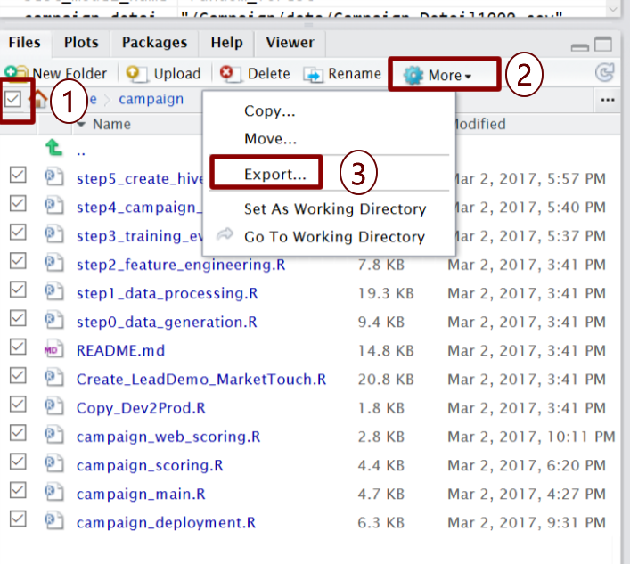

 This page describes the 
<strong>
{{ site.hdi_text }} 
</strong>
solution.

 

## HDInsight Cluster 
--------------------------------

An initial cluster was created when you used the `Deploy` button from [Cortana Intelligence Gallery](https://aka.ms/campaign-hdi). Along with the cluster, a storage account was created.  This is where all data is stored.  

When you are finished using the entire solution, you can delete all your resources on the [Cortana Intelligence Gallery](https://aka.ms/campaign-hdi) Deployments page. 

If you would like to continue using the solution, you can delete the cluster while  keeping the storage account. You can then re-use the storage account later on a new cluster. 

## Deleting the Cluster

HDInsight Spark cluster billing starts once a cluster is created and stops when the cluster is deleted. Billing is pro-rated per minute, so you should always <strong>delete your cluster</strong> when it is no longer in use.

Before you delete the cluster, <a href="Typical.html#rstudiologin?path=hdi">login to RStudio</a> on the cluster edge node and save your files. 

<ol>
<li>
In the Files tab on the bottom right, check the checkbox to select all files.
</li>
<li>
Use the <code>More</code> button to find the <code>Export...</code> option.
</li>
<li>
Select <code>Export...</code> to save the files.
</li>
</ol>

Once you've saved your files you can [use these steps to delete your cluster.](https://docs.microsoft.com/en-us/azure/hdinsight/hdinsight-delete-cluster)

## Re-Using the Storage Account on a New Cluster

You can use the Azure portal to create a new cluster by [following the steps shown here](https://docs.microsoft.com/en-us/azure/hdinsight/hdinsight-hadoop-r-server-get-started).  Make sure you select your existing storage account instead of creating a new one, and you can pick up where you left off.

Once your cluster is ready, go to RStudio and Import the files by with the <code>Upload</code> button.  Select the zip file that you exported prior to deleting the original cluster.

## Scaling a Cluster
You can also [use the Azure portal](https://docs.microsoft.com/en-us/azure/hdinsight/hdinsight-administer-use-portal-linux#scale-clusters) to scale your cluster.

## Scaling Microsoft R Server Operationalization Compute Nodes
This solution currently uses a single node for Operationalization - the cluster edge node.  [View instructions here](https://docs.microsoft.com/en-us/azure/hdinsight/hdinsight-hadoop-r-server-get-started#how-to-scale-microsoft-r-server-operationalization-compute-nodes-on-hdinsight-worker-nodes) to add compute nodes to the Operationalization Server.
