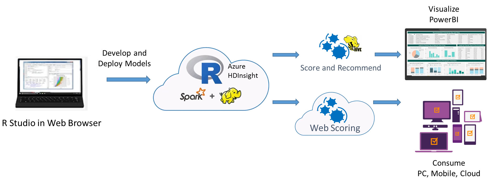
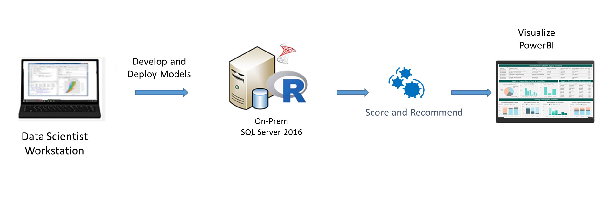

Are you unable to connect to your Virtual Machine? See this important information for
<a href="https://blogs.technet.microsoft.com/mckittrick/unable-to-rdp-to-virtual-machine-credssp-encryption-oracle-remediation/">how to resolve.</a>

When a business launches a marketing campaign to interest customers in new or existing product(s), they often use a set of business rules to select leads for their campaign to target. Machine learning can be used to help increase the response rate from these leads. This solution demonstrates how to use a model to predict actions that are expected to maximize the purchase rate of leads targeted by the campaign. These predictions serve as the basis for recommendations to be used by a renewed campaign on **how to contact** (for example, e-mail, SMS, or cold call) and **when to contact** (day of week and time of day) the targeted leads. 

The solution presented here uses simulated data from the insurance industry to model responses of the leads to the campaign. The model predictors include demographic details of the leads, historical campaign performance, and product-specific details. The model predicts the probability that each lead in the database makes a purchase from a channel, on each day of the week at various times of day. Recommendations on which channel, day of week and time of day to use when targeting users are based then on the channel and timing combination that the model predicts will have the highest probability a purchase being made. 

The Microsoft Marketing Campaign Optimization solution is a combination of a Machine learning prediction model and an interactive visualization tool, PowerBI. The solution is used to increase the response rate to a campaign by recommending the channel to contact (for example, e-mail, SMS, or cold call) as well as when to contact (day of week and time of day) targeted leads for use in a new campaign. The solution uses simulated data, which can easily be configured to use your own organization’s data, to model the acquisition campaign response. The model uses predictors such as demographics, historical campaign performance and product details. 

This solution predicts the probability of a lead conversion from each channel, at various times of the day and days of the week, for every lead in the database. The final recommendation for targeting each lead is decided based upon the combination of channel, day of week and time of day with the highest probability of conversion. The solution has been modeled after a standardized data science process, where the data preparation, model training and evaluation can be easily done by a data scientist and the insights visualized and correlated to KPIs by marketing via Power BI visualization.

<h2>Select the platform you wish to explore:</h2>
 <form style="margin-left:30px"> 
    <label class="radio">
      <input type="radio" name="optradio" class="rb" value="cig" >{{ site.cig_text }}, deployed from the <a href="START_HERE.html">Quick Start Page</a>.
    </label>
    <label class="radio">
      <input type="radio" name="optradio" class="rb" value="onp">{{ site.onp_text }}
    </label>
   <label class="radio">
      <input type="radio" name="optradio" class="rb" value="hdi">{{ site.hdi_text }}, deployed from the <a href="START_HERE.html">Quick Start Page</a>.
    </label> 
</form>

On the VM created for youusing the 'Deploy to Azure' button on the <a href="START_HERE.html">Quick start</a> page, the SQL Server 2017 database <code>Campaign</code> contains all the data and results of the end-to-end modeling process.  

For customers who prefer an on-premise solution, the implementation with SQL Server ML Services is a great option that takes advantage of the powerful combination of SQL Server and the R language.  A Windows PowerShell script to invoke the SQL scripts that execute the end-to-end modeling process is provided for convenience. 

This solution shows how to pre-process data (cleaning and feature engineering), train prediction models, and perform scoring on the  HDInsight Spark cluster with Microsoft ML Server deployed using the 'Deploy to Azure' button on the <a href="START_HERE.html">Quick start</a> page.

<strong>HDInsight Spark cluster billing starts once a cluster is created and stops when the cluster is deleted. See <a href="hdinsight.html"> these instructions for important information</a> about deleting a cluster and re-using your files on a new cluster.</strong>

 We have modeled the steps in the template after a realistic team collaboration on a data science process. Data scientists do the data preparation, model training, and evaluation from their favorite R IDE.using the Open Source Edition of RStudio Server on the cluster edge node.
 
 DBAs can take care of the deployment using SQL stored procedures with embedded R code.  We show how each of these steps can be executed on a SQL Server client environment such as SQL Server Management Studio.
  
 
 Scoring is implemented with <a href="https://msdn.microsoft.com/en-us/microsoft-r/operationalize/about">ML Server Operationalization</a>.
 
 Finally, a Power BI report is used to visualize the deployed results.

 

